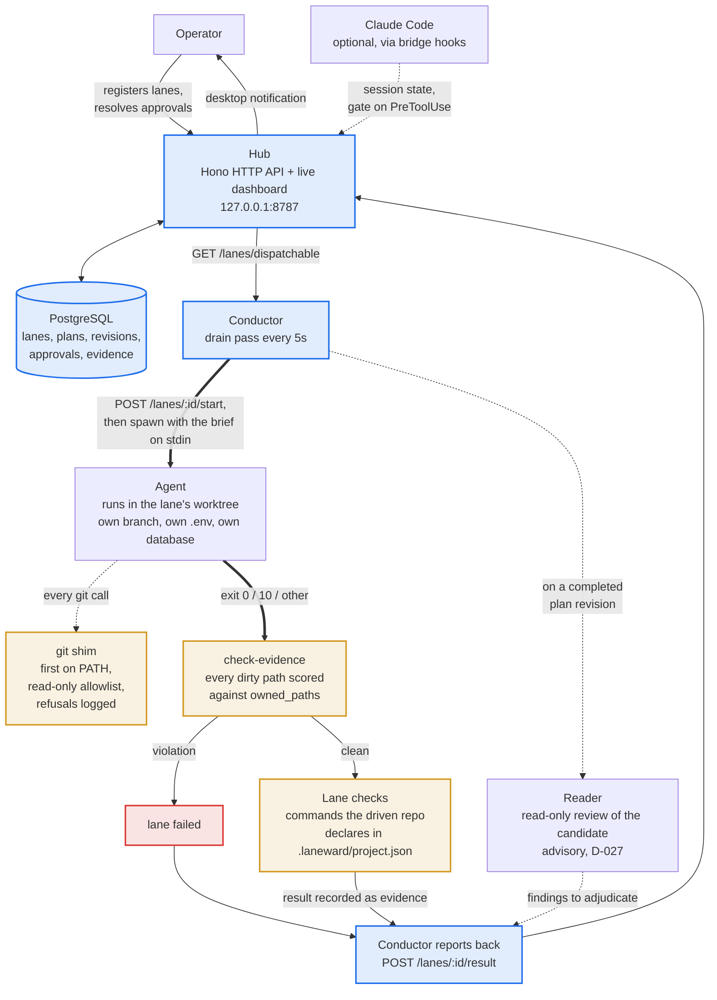
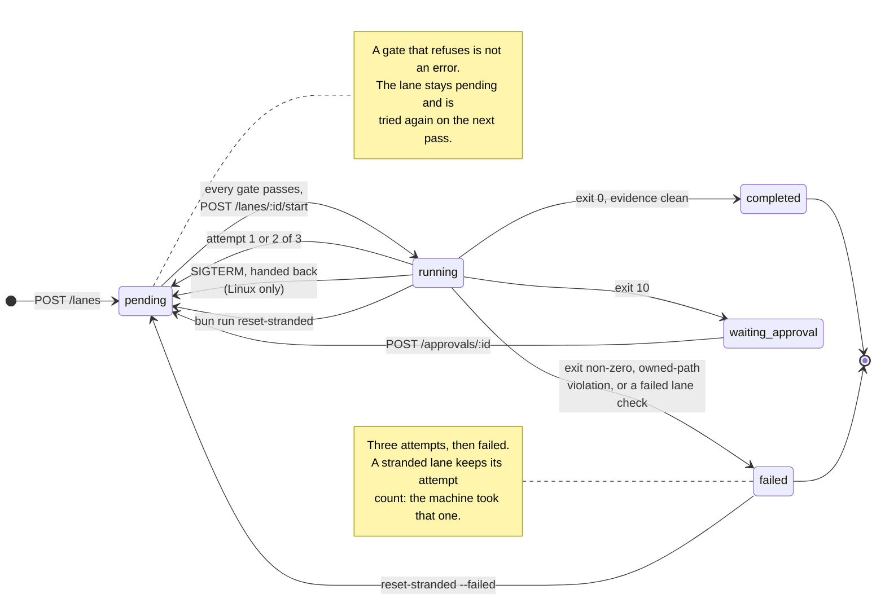
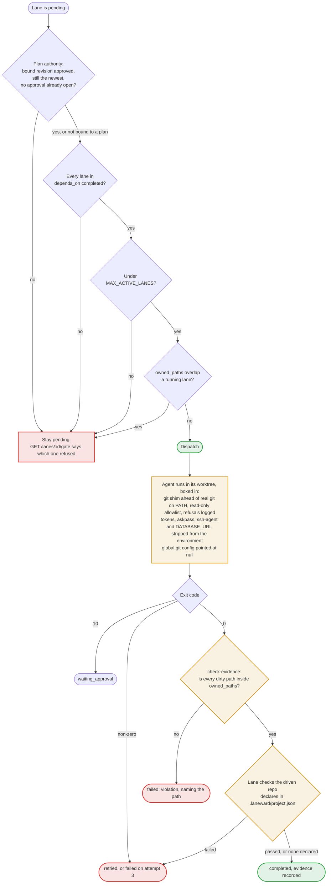

# Laneward

Laneward runs several coding agents on one repository at the same time, each in its own git worktree, and keeps them from colliding. Approved work continues after you close your editor.

[](https://github.com/aethrox/laneward/actions/workflows/ci.yml)
[](LICENSE)

It does not plan work and it does not write code. You or your editor decide what needs doing; Laneward records each task, decides when it is safe to start, spawns the agent, checks what it touched, and shows the result on one screen.

A unit of work is called a **lane**. A lane owns a set of file paths, a worktree, a branch, and a database of its own. Two lanes that claim the same path cannot run at the same time, and Laneward is what enforces that.

> [!IMPORTANT]
> Two things to know before you install, not after.
>
> Laneward listens on `127.0.0.1` with **no authentication**. It is built for one trusted single-user machine. Do not expose it.
>
> Each lane's worktree receives a **copy of the driven repository's `.env`**, so an agent can read your real secret values. Only `DATABASE_URL` is rewritten, to a database created for that lane. Redaction is not implemented.

## Quick start

Needs [Bun](https://bun.sh) 1.3.14 or newer, git, and a PostgreSQL you can reach. On Linux with rootless Podman, `install.sh` brings its own database.

```bash
git clone https://github.com/aethrox/laneward.git && cd laneward
bun install
cp .env.example .env          # edit DATABASE_URL, and set LANEWARD_AGENT
bun run db:migrate
bun run start                 # dashboard on http://127.0.0.1:8787
```

There is no default agent. Set `LANEWARD_AGENT=codex` or `LANEWARD_AGENT=claude` in `.env`, or give `LANEWARD_AGENT_WRITE` a raw command array instead; the first lane fails with a refusal until one is declared. See [Agent presets](#agent-presets).

In a second terminal, register a lane against a repository you want worked on and let the conductor pick it up:

```bash
LANE_REPO=/path/to/your/repo bun scripts/new-lane.ts fix-login brief.md src/auth
bun run conductor --loop
```

`brief.md` is the instruction the agent reads on stdin. `src/auth` is the only path this lane may touch; anything else it writes fails the lane.

To run it as a supervised service that outlives your editor, see [Installation](#installation).

## How it works

### The pieces

The hub owns all state and answers HTTP. The conductor is a loop that asks the hub what it may start, spawns agents, and reports back. Nothing else writes to the database.



There is no default agent. See [Agent presets](#agent-presets).

### A lane's life

A lane stays `pending` until every gate agrees, then `running` while an agent holds it. How it leaves `running` is decided by the agent's exit code.



> [!NOTE]
> `completed` means the agent exited 0, touched only what it owned, and its declared checks passed. It does **not** mean the work is correct, reviewed, committed, or merged. Commit and merge stay manual by design.

### What a lane has to get past

Nothing here trusts the agent. The gates before dispatch are ordered so the cheapest refusal comes first, and the checks after it run whether or not the agent claims success.



The shim is defence in depth, not the only control: a sandboxed agent usually denies these calls itself. The shim exists because that sandbox was once observed absent for hours on this host.

## What it does today

- Records lanes, plans, plan revisions, approvals and evidence in PostgreSQL.
- Creates a worktree, a branch, and a per-lane database for each lane, with the driven repo's own `db:migrate` applied to it.
- Refuses to register a lane whose `owned_paths` overlap a lane that is not finished.
- Enforces `depends_on`, a concurrency ceiling, and plan-revision authority.
- Spawns any agent that reads a brief on stdin and signals with its exit code.
- Retries a failing lane up to three attempts.
- Scores every dirty path in the worktree against `owned_paths` and fails the lane on a violation.
- Runs the checks the driven repository declares and records their results as evidence.
- Runs an advisory read-only reader over a completed plan revision and records findings for adjudication.
- Builds an integration candidate and runs its verification layers at the end of a drain pass.
- Sends desktop notifications for the events that block work.
- Hands running lanes back on `SIGTERM`, and recovers stranded ones with `reset-stranded`.
- Installs as a supervised service on Linux (systemd user units plus a Quadlet database) and Windows (a Scheduled Task at logon).

## What it does not do

- Plan work, split it into lanes, or write briefs.
- Commit, merge, push, or open pull requests. All four are deliberately manual.
- Redact secrets from the `.env` it copies into a lane worktree.
- Prevent a second conductor from running against the same database.
- Authenticate anything, or serve anywhere but `127.0.0.1`.

## Daily use

```bash
bun run start                                     # hub and dashboard
bun run conductor --loop                          # keep draining
bun run conductor                                 # one pass, then exit

bun scripts/new-lane.ts <id> <brief> <paths...>   # register a lane
bun run reset-stranded --dry-run                  # what a crash left behind
bun run teardown <lane-id>                        # drop the lane's database
```

Open `http://127.0.0.1:8787` for the dashboard: lanes and their status, open approvals, failed lanes, reader findings, and each lane's log. `GET /pending` is the same information as JSON, which is what the desktop notifier and the Claude Code bridge read.

## Installation

Both installers stage the app atomically, validate the `.env` they will actually load, refuse legibly when a prerequisite is missing, and print exactly what they did not do. Both take `--uninstall`.

> [!WARNING]
> Neither platform has survived a reboot or a logout yet. On Linux the units stop at logout unless `loginctl enable-linger` is enabled, a persistent host change the installer deliberately does not make for you. On Windows the logon trigger is registered but has never fired from a real logoff and logon.

### Linux

```bash
./install.sh
```

Installs `laneward.service`, `laneward-conductor.service`, and, when `DATABASE_URL` points at this host, a `laneward-db.container` Quadlet with its own `pgdata` volume. Point `DATABASE_URL` at a Postgres you already run and it installs neither and says so.

```bash
systemctl --user start laneward-db.service laneward.service
cd ~/.local/share/laneward/app
bun --env-file=~/.config/laneward/.env run db/migrate.ts
systemctl --user start laneward-conductor.service
journalctl --user -u laneward.service -u laneward-conductor.service -n 30
```

### Windows

Needs a running Podman machine for the database.

```powershell
.\install.ps1
```

Registers a `laneward-conductor` Scheduled Task at logon. The deployed app directory has no `.env` of its own, so every command run from it needs `--env-file`:

```powershell
cd $env:LOCALAPPDATA\laneward\app
bun --env-file=$env:APPDATA\laneward\.env run db:migrate
bun --env-file=$env:APPDATA\laneward\.env run start
Start-ScheduledTask -TaskName laneward-conductor
```

> [!CAUTION]
> Stopping the task terminates the conductor. Windows has no catchable `SIGTERM`, so unlike the Linux unit it cannot hand its lanes back; they are left `running` with no worker behind them. This is expected, and it is the same state a crash leaves. Recover with `bun --env-file=... run reset-stranded`.

## Configuration

Everything is read from the `.env` the service loads.

| Variable | Default | Purpose |
|---|---|---|
| `DATABASE_URL` | none, required | Where the hub keeps its state |
| `PORT` | `8787` | Hub listen port; the conductor derives its hub address from it |
| `MAX_ACTIVE_LANES` | `3` | Concurrency ceiling |
| `HUB_URL` | derived from `PORT` | Override when the conductor is elsewhere |
| `LANEWARD_NOTIFY` | `approval_required,lane_failed` | Comma-separated notification classes; empty disables them |
| `LANEWARD_DRAIN_INTERVAL_MS` | `5000` | Pause between drain passes |
| `LANEWARD_AGENT` | none, required unless `LANEWARD_AGENT_WRITE` is set | Selects a preset: `codex` or `claude` |
| `LANEWARD_MODEL_FAST` / `_BALANCED` / `_DEEP` | preset's table | Remap a model tier to any model string |
| `LANEWARD_AGENT_WRITE` | preset's write template | JSON argument array for the working agent |
| `LANEWARD_AGENT_READ` | preset's read-only template | JSON argument array for the read-only reader |
| `LANEWARD_AGENT_BIN` | preset's `bin` | Overrides a preset's argv[0]; ignored by a raw declared template, which owns its own argv[0] |
| `LANEWARD_LOG_DIR` | platform state dir | Where lane logs are written |
| `LANEWARD_CHECK_TIMEOUT_MS` | per check | Ceiling for a declared lane check |

A model tier (`fast`, `balanced`, `deep`) is a slot you fill, not a model name. The names are a cost and capability ladder; what each one resolves to is yours to set.

### Agent presets

An agent is a named preset. `LANEWARD_AGENT=codex` or `LANEWARD_AGENT=claude` selects one, and it carries its own argument arrays per sandbox mode, its own default binary, and its own model-tier defaults. There is no default: with neither `LANEWARD_AGENT` nor `LANEWARD_AGENT_WRITE` set, Laneward refuses and names both ways to declare one.

| Preset | Resolves to |
|---|---|
| `codex` | `codex exec -C {worktree} -s workspace-write -m {model}` (write), `-s read-only` (read-only) |
| `claude` | `claude -p --permission-mode acceptEdits --disallowedTools "Bash(git *)" --model {model}` (write), `--permission-mode plan --disallowedTools Edit Write NotebookEdit Bash` (read-only) |

Only these two ship, because only these two were run against this project. Adding an agent means adding a preset plus a real lane driven by it, not just writing the flags down.

For anything else, declare a raw command template per sandbox mode instead of a preset. `{bin}`, `{worktree}` and `{model}` are substituted, and the array is passed to the OS as-is, because paths on Windows contain spaces.

```bash
LANEWARD_AGENT_WRITE='["my-agent","run","--dir","{worktree}","--model","{model}"]'
LANEWARD_AGENT_READ='["my-agent","run","--readonly","--dir","{worktree}","--model","{model}"]'
```

An agent has to promise four things:

1. Read its instruction from **stdin**, not from a positional argument. An agent that takes a positional prompt waits on stdin forever when backgrounded.
2. Work in the **directory it is given**, and edit only what the brief allows.
3. Exit **0** on completion, **10** to request approval, non-zero otherwise.
4. Perform **no git mutation**. This one is enforced by the shim rather than trusted, so an unknown agent inherits the same boundary.

Declaring `LANEWARD_AGENT_WRITE` without `LANEWARD_AGENT_READ` **disables the reader** and records it as `skipped` with the reason. That is deliberate: the reader's read-only confinement is the agent's to provide, and Laneward will not run it unconfined over the candidate it is reviewing.

## API

25 routes over four areas. Plans and revisions carry execution authority, lanes carry work, and approvals carry the decisions a human has to make.

| Area | Routes |
|---|---|
| Plans | `POST /plans`, `POST /plans/:id/revisions`, `POST /plans/:id/revisions/:revision/approve`, `GET /plans/:id`, `GET /candidates/due` |
| Verification | `POST /verification-runs`, `GET /verification-runs/latest`, `POST /verification-runs/:id/result`, `POST /verification-runs/:id/findings`, `GET /plan-revisions/:id/findings`, `POST /plan-revisions/:id/approvals`, `GET /plans/:id/rejected-findings`, `POST /verification-findings/:id/adjudication` |
| Lanes | `POST /lanes`, `GET /lanes`, `DELETE /lanes/:id`, `GET /lanes/dispatchable`, `GET /lanes/:id/gate`, `POST /lanes/:id/start`, `POST /lanes/:id/messages`, `POST /lanes/:id/result`, `GET /lanes/:id/evidence` |
| Approvals | `GET /pending`, `POST /approvals/:id` |

A lane bound to a plan revision may start only while that revision is approved and is still the newest. A material plan change becomes a new revision, and that is what withdraws the execution authority of every lane bound to the old one.

## Logs and recovery

Lane logs go to the platform state directory, one file per lane, plus a `.git-guard.jsonl` recording every git call the shim refused. The dashboard reads the same files.

After a crash, a reboot, or a Windows task stop, lanes can be left `running` with nothing behind them:

```bash
bun run reset-stranded --dry-run   # list them
bun run reset-stranded             # return them to pending
bun run reset-stranded --failed    # retry genuinely failed lanes, attempt count cleared
```

> [!WARNING]
> `reset-stranded` resets every `running` lane. Do not run it while another conductor is active.

## Requirements

- **Bun** 1.3.14 or newer. Both installers warn below this. It is the version everything here was verified against, not a measured floor.
- **git**, verified on 2.54.0.
- **PostgreSQL** 16. Linux can install the shipped container for you.
- **Codex CLI** 0.147.0 or newer, only for the `codex` preset.
- **Claude Code**, only for the `claude` preset.
- **Linux**: rootless Podman and a working `systemctl --user`.
- **Windows**: a Podman machine, or any reachable PostgreSQL.

## Limitations

What has been verified by actually running it, per platform, and what has not.

**Linux.** Installs, runs as two systemd user services, completes a lane unattended, enforces path ownership with nobody watching, and stops cleanly with its lanes handed back. The shipped database container starts from its Quadlet, takes the migration, and its volume survives a restart of the unit. That evidence comes from a privileged container sharing the host kernel, not from bare metal or a VM.

**Windows.** Installs, runs as a Scheduled Task, and completed a lane driven by a real Codex worker with nobody attached. Stopping the task mid-lane strands the lane and `reset-stranded` recovers it, verified as a round trip.

**Neither platform** has survived a reboot or a logout. The Windows logon trigger has never fired from a real cycle. A real Codex worker has run under the Windows task but never under systemd. Docker, macOS, and other service setups are untried.

Other current gaps:

- **Secrets.** The `.env` copy into each lane worktree is the largest one. Only `DATABASE_URL` is rewritten.
- **No authentication**, `127.0.0.1` only, single user by design.
- **Multi-conductor operation is unsafe** and nothing enforces a single one.
- **Git exposure.** The repository-local git config, including the remote URL, is readable from inside a lane worktree.
- **No vulnerability reporting channel.** There is no `SECURITY.md` and GitHub-level hardening is not configured. That is `doctrine:repo-secure`'s job rather than this README's.

`docs/notes/` records what was run, what it found, and what it did not establish. [What is left](docs/notes/2026-08-19-what-is-left.md) is the current open list.

## More information

- [Workflow v1 target architecture](docs/architecture/workflow-v1/README.md), including the decision log every `D-0NN` reference points at
- [Glossary](docs/GLOSSARY.md)
- [Task brief template](docs/brief-template.md)
- [Evidence notes](docs/notes/): what was run, what it found, and what it did not establish
- [AGENTS.md](AGENTS.md) and [docs/agents/](docs/agents/): what the `doctrine` skills read to learn this repo's conventions

## License

MIT. See [LICENSE](LICENSE).
