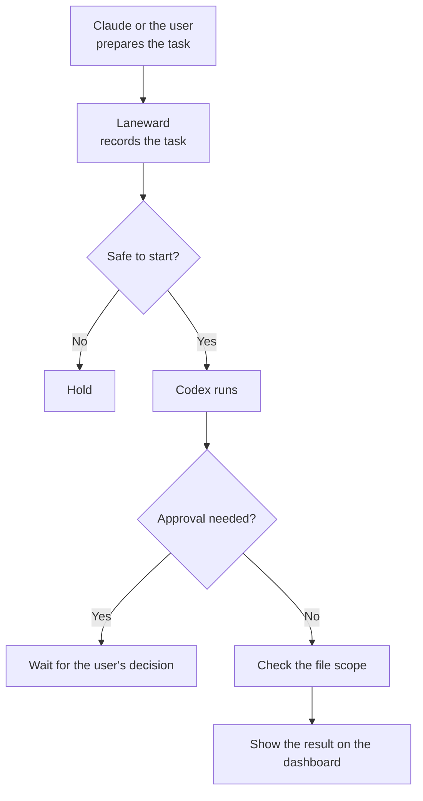

# Laneward

Laneward is a local control centre that keeps several Codex tasks working safely and in order on the same project.

It does not plan work and does not write code by itself. It records tasks, controls their order, prevents conflicts, runs Codex processes, and shows the results on one screen.

> In short: Claude or the user plans the work, Laneward organises the workers, Codex works on the code.

## Why it exists

When several AI tasks run in parallel on the same project, these problems can appear:

- Two tasks change the same file at the same time.
- A task starts before another task it depends on has finished.
- Too many tasks run at once and exhaust the machine.
- A task asks a question or requests approval and nobody notices.
- It becomes hard to track which task is running and which one failed.

Laneward reduces these problems with a central record and control system.

## How it works



Each independent task inside Laneward is called a **lane**.

Every lane knows:

- what it has to do;
- which files it may touch;
- which lanes it must wait for before starting;
- which working directory it runs in;
- how many times it has been attempted;
- whether it needs approval or human intervention.

## What it can do today

- Records lanes in a PostgreSQL database.
- Helps create a separate Git worktree and branch for each lane.
- Blocks two active lanes that claim the same file scope.
- Enforces lane dependencies.
- Limits how many lanes may run at the same time.
- Runs eligible lanes with Codex.
- Retries up to three times on transient failures.
- Holds a lane when Codex asks for approval.
- Writes each lane's output to a separate log file.
- Shows results on a live dashboard.
- Requeues running lanes safely on a normal `Ctrl-C` shutdown.
- Builds an integration candidate and runs its verification layers at the end of a conductor drain pass.
- Runs on Fedora with rootless Podman and systemd user services.

## What it does not do yet

The following capabilities do not exist:

- automatic plan creation and plan approval through Claude Code;
- automatic commit, merge, or push;
- a mandatory test gate that proves functional correctness;
- safe multi-conductor operation;
- remote or multi-user access.

See the [Workflow v1 documents](docs/architecture/workflow-v1/README.md) for the target architecture and the implementation roadmap.

## Important: what `completed` means

In today's system, a lane reaching `completed` only shows that:

1. the Codex process finished with a successful exit code;
2. a write lane actually produced a change;
3. the changes stayed inside the file paths the lane was allowed to touch.

It does not guarantee that:

- the code works correctly;
- the required tests passed;
- changes from different lanes work together;
- the change was reviewed, committed, or merged;
- the product was installed and verified in a real environment.

For that reason the current `completed` state on the dashboard should be read as **file scope verified**.

Final review, testing, commit, and merge are still the responsibility of Claude or the human operator.

## Candidate verification

When every lane in a plan's newest revision is `completed`, the conductor builds a
**candidate**: an integration branch and worktree that merge those lane branches
onto the checkout's current `HEAD`. It has a database of its own when the project
uses one.

The conductor records three verification layers for that candidate, in order:

1. **Construction** builds the candidate.
2. **Independent clean run** starts the candidate using the project's declared environment and judges its declared observations. It does not run the suite.
3. **Reader** reviews the declared test diff, with the source diff as context.

If an earlier layer does not succeed, the later layer records `skipped` and names
the layer that prevented it from running. These records do not change a lane's
`completed` state. The reader is advisory forever: a report with findings, or an
empty `no_findings` report, is never a gate.

Each reader finding records its text, whether it is out of change, its `subject`
(`test_diff` or `source_context`), and one or more `locations` containing a path,
diff side, and line range. A human adjudicates an open finding as `accepted`,
`rejected`, or `deferred`; rejected findings are supplied as context to later
reader runs. See the [workflow decisions](docs/architecture/workflow-v1/01-decisions.md)
for the rationale and operating details.

## Daily use

### 1. Prepare a task brief

Starting template:

```text
docs/brief-template.md
```

The brief must state the objective, the allowed files, the test expectations, and the situations that require approval.

### 2. Create a new lane

```bash
bun scripts/new-lane.ts <lane-id> <brief-file> <owned-path>...
```

Example:

```bash
bun scripts/new-lane.ts fix-login docs/briefs/fix-login.md src/auth tests/auth
```

To work on a different project:

```bash
LANE_REPO=/path/to/project \
bun scripts/new-lane.ts fix-login docs/briefs/fix-login.md src/auth
```

If the lane must wait for another lane:

```bash
LANE_DEPENDS_ON="database-lane" \
bun scripts/new-lane.ts api-lane docs/briefs/api.md src/api
```

### 3. Run the eligible lanes

```bash
bun run conductor
```

The conductor:

1. finds the lanes eligible to start;
2. checks the safety gate;
3. runs the Codex processes;
4. records the logs;
5. sends the result to Laneward;
6. builds due candidates and records their verification layers;
7. exits when no lane is left to run.

Add `--loop` and it does not exit: it repeats the pass every
`LANEWARD_DRAIN_INTERVAL_MS` until it is signalled. That is the form
`laneward-conductor.service` runs, and it is what makes an approved lane
continue after Claude is closed. A pass that fails is logged and the loop
continues, because the likeliest failure is the hub being unreachable during its
own restart.

On `SIGTERM` the conductor kills its workers, hands every running lane back to
Laneward as an ordinary failure, and exits 0. Laneward returns those lanes to
`pending`, so nothing needs manual cleanup after a stop or a reboot. `SIGINT`
does the same but exits non-zero, because interrupting a one-shot run is an
abandoned run rather than a completed one.

Signal handling is verified on Linux only. Windows has no POSIX signal delivery,
so `tests/conductor.signals.test.ts` and the `SIGTERM` case in
`tests/conductor.loop.test.ts` both skip there.

### 4. Follow the state

While Laneward is running, the dashboard is at:

```text
http://127.0.0.1:8787
```

The dashboard is reachable only from the local machine and is read-only today.

### 5. Resume a lane that is waiting for approval

A lane can stop with one of these markers:

```text
APPROVAL REQUIRED
HOST VERIFICATION REQUIRED
```

Record the decision through the Laneward API, then run the conductor again. This
starts a **new** `codex exec` process; there is no session to restore. The new
process receives the lane's original brief with the decision appended, so it has
the same written context the first attempt had, plus the answer — but not the
first attempt's reasoning or its uncommitted in-memory state.

## API routes

Plans:

| Route | Purpose |
|---|---|
| `POST /plans` | Create a plan and its revision 1, unapproved |
| `POST /plans/:id/revisions` | Add the next revision, unapproved |
| `POST /plans/:id/revisions/:revision/approve` | Approve one exact revision |
| `GET /plans/:id` | The plan and every revision, newest first |
| `GET /candidates/due` | Newest completed revisions with no construction attempt |

Verification:

| Route | Purpose |
|---|---|
| `POST /verification-runs` | Open an attempt for `construction`, `clean_run`, or `reader` |
| `GET /verification-runs/latest` | Latest attempt for a revision and layer |
| `POST /verification-runs/:id/result` | Close an attempt with its recorded result |
| `POST /verification-runs/:id/findings` | Record a reader finding while its run is open |
| `GET /plan-revisions/:id/findings` | Findings for one plan revision |
| `POST /plan-revisions/:id/approvals` | Open a human approval request for one revision, or return the one already open |
| `GET /plans/:id/rejected-findings` | Rejected findings, as context for the next reader run |
| `POST /verification-findings/:id/adjudication` | Adjudicate an open finding |

Lanes:

| Route | Purpose |
|---|---|
| `POST /lanes` | Register a lane, optionally bound to a `plan_revision_id` |
| `GET /lanes` | Every lane with its status, worktree and bound plan revision |
| `DELETE /lanes/:id` | Remove a lane and its messages and approvals, unless it is running |
| `GET /lanes/dispatchable` | Everything the conductor may act on |
| `GET /lanes/:id/gate` | Whether the lane may start, and why not |
| `POST /lanes/:id/start` | Move a lane to `running`, behind the gate |
| `POST /lanes/:id/messages` | Record a worker message |
| `POST /lanes/:id/result` | Record a worker's exit verdict |
| `GET /lanes/:id/evidence` | The lane's recorded check results |

Approvals:

| Route | Purpose |
|---|---|
| `GET /pending` | Open approvals, failed lanes, and reader findings to adjudicate |
| `POST /approvals/:id` | Resolve an approval: `resolved_by`, optional `verified_by`, `decision` |

A lane bound to a plan revision may only start when that revision is approved
and is still the plan's newest revision. A material plan change is recorded as a
new revision, which is what withdraws the execution authority of every lane
bound to the old one. `resolved_by` records who entered a decision;
`verified_by` records who performed the verification behind it, which the
Phase 4 pilot found are not always the same.

## Installation

### Read this before installing

Two properties of Laneward are deliberate, and both are easier to accept before
an install than to discover after one.

**A lane worker can read the driven repository's secrets.**
`scripts/new-lane.ts` copies that repository's `.env` into the lane worktree, so
the Codex worker sees real secret values. Only `DATABASE_URL` is rewritten, to a
per-lane database. Redaction and restricted credentials are not implemented. If
you would not hand the contents of a repository's `.env` to a model, do not
point Laneward at that repository.

**There is no authentication.** Laneward listens on `127.0.0.1` and is built for
one trusted single-user machine. Anything that can reach the port can approve
plans and dispatch lanes. Do not expose it to a network.

### Requirements

- Windows or Linux
- Bun — verified on 1.3.14
- An agent CLI. Codex is the default and the verified one (0.147.0); any agent
  that reads its instruction from stdin works, see
  [Using an agent other than Codex](#using-an-agent-other-than-codex)
- Git — verified on 2.54.0

Both installers warn when they find an older Bun or Codex. Those are the
versions Laneward was verified against rather than measured floors: no lower
version has been shown to fail, so the installers warn instead of refusing.

Linux needs systemd user services; Windows uses a Scheduled Task instead, per
D-038. Podman is needed only for the database this package ships — point
`DATABASE_URL` at a Postgres you already run and `install.sh` installs no
quadlet and does not ask for podman.

Both paths have been run to a working system. Linux: services started, a lane
completed unattended, a clean stop mid-lane
([notes](docs/notes/2026-08-15-d014-demonstrated.md)). Windows: the Scheduled
Task started, a real Codex worker completed a lane unattended, and a lane
stranded by stopping the task was recovered with `reset-stranded`
([notes](docs/notes/2026-08-19-s3-windows-end-to-end.md)). Neither has survived a
reboot or a logout.

### Install as a service, Linux

```bash
./install.sh
```

Then check the configuration file:

```bash
nano ~/.config/laneward/.env
```

Start the services:

```bash
systemctl --user start laneward-db.service laneward.service
```

Create or update the database tables:

```bash
cd ~/.local/share/laneward/app
bun --env-file=~/.config/laneward/.env run db:migrate.ts
```

Check the state:

```bash
systemctl --user status laneward.service
journalctl --user -u laneward.service -n 30
```

If the services must keep running after the user session ends:

```bash
loginctl enable-linger "$USER"
```

This command is a persistent system change. Check what it does before running it.

### Install as a service, Windows

The database is the same container image as on Linux, running in a Podman
machine with its port published on `127.0.0.1` (D-037). The conductor is a
Scheduled Task at logon rather than a service (D-038).

Start the Podman machine first. The installer refuses without it, because a
stopped machine does not fail fast — every query times out after 5000 ms and
reads as an application bug:

```powershell
podman machine start
```

It does not start itself after a reboot. That is the single most likely reason
a working install stops working.

Then install. `-DryRun` renders everything and registers nothing, which is worth
running first:

```powershell
.\install.ps1 -DryRun
```

```powershell
.\install.ps1
```

This writes `%APPDATA%\laneward\.env`, stages the app into
`%LOCALAPPDATA%\laneward\app`, and registers the `laneward-conductor` task. Edit
the configuration before starting anything:

```powershell
notepad $env:APPDATA\laneward\.env
```

`DATABASE_URL` must point at `127.0.0.1`. The installer warns when it does not,
because a `.env` copied from another machine tends to carry that machine's WSL
address, which works until the Podman machine is recreated.

Migrate, then start the hub. Every command run from the app directory needs
`--env-file`: the deployed app has no `.env` of its own, deliberately, and
without it the hub exits at once complaining that `DATABASE_URL` is unset.

```powershell
cd $env:LOCALAPPDATA\laneward\app; bun --env-file=$env:APPDATA\laneward\.env run db:migrate
```

```powershell
cd $env:LOCALAPPDATA\laneward\app; bun --env-file=$env:APPDATA\laneward\.env run start
```

Then start the conductor task:

```powershell
Start-ScheduledTask -TaskName laneward-conductor
```

```powershell
Get-ScheduledTaskInfo -TaskName laneward-conductor
```

**Stopping the task strands the lanes it was running.** Windows has no catchable
`SIGTERM`, so unlike the Linux unit the conductor cannot hand them back; they are
left `running` with no worker behind them. This is expected, not a fault, and it
is the same state a crash or a reboot leaves. Recover with:

```powershell
cd $env:LOCALAPPDATA\laneward\app; bun --env-file=$env:APPDATA\laneward\.env run reset-stranded --dry-run
```

```powershell
cd $env:LOCALAPPDATA\laneward\app; bun --env-file=$env:APPDATA\laneward\.env run reset-stranded
```

Lane logs are under `%LOCALAPPDATA%\laneward\logs` unless `LANEWARD_LOG_DIR`
says otherwise.

## Local development

### 1. Start the development database

```bash
podman run -d \
  --name laneward-db-dev \
  -e POSTGRES_USER=laneward \
  -e POSTGRES_PASSWORD=laneward \
  -e POSTGRES_DB=laneward \
  -v laneward-dev-pgdata:/var/lib/postgresql/data \
  -p 127.0.0.1:5434:5432 \
  docker.io/library/postgres:16-alpine
```

### 2. Prepare the development configuration

```bash
cp .env.example .env
```

Change the PostgreSQL port in `.env` to `5434`.

> Do not run development tests against port `5433`, which the installed service uses. The tests truncate tables and can delete real Laneward data.

### 3. Install dependencies and prepare the database

```bash
bun install
bun run db:migrate
```

### 4. Run the tests and the typecheck

```bash
bun test
bun run typecheck
```

`bun test` truncates the database `DATABASE_URL` points at, so point it at a
scratch database rather than the one the hub is using. `bun run typecheck` is
`tsc --noEmit` against a pinned local TypeScript, so it gives the same answer on
every machine.

### 5. Start the development server

```bash
bun run dev
```

## Logs and recovery

Default lane log directory:

```text
$XDG_STATE_HOME/laneward/logs
```

To follow a log live:

```bash
tail -f <log-directory>/<lane-id>.log
```

A normal `Ctrl-C` shutdown returns running lanes to the queue.

After a machine shutdown or a `SIGKILL`, some lanes can stay in `running`. Inspect first:

```bash
bun run reset-stranded --dry-run
```

Then, if needed:

```bash
bun run reset-stranded
```

This command resets every `running` lane. Do not use it while another conductor is active.

## Closing a lane

`scripts/new-lane.ts` creates three things: a worktree, a `lane/<lane_id>`
branch and a database. One command removes all three:

```bash
bun run teardown <lane-id>
```

Nothing runs it for you. A lane reaching `completed` does not tear itself down,
because that would delete a worktree at a moment nobody is watching.

It refuses, and removes nothing, when the worktree has uncommitted changes or
when the branch carries commits this checkout does not. Both are reported so you
can integrate or discard them and run it again. A clean lane is removed without
further questions.

The lane's own row, its evidence and its logs survive teardown. Only what
`new-lane.ts` created is removed, and the database only when its name is one
this lane could have produced, so a lane whose provisioning never ran can never
aim the drop at the hub's own database.

## Building the integration candidate

When every lane of a plan's newest revision is `completed`, the conductor builds
the candidate at the end of its drain pass. The same command is available when an
operator needs to build one explicitly:

```bash
bun run build-candidate <plan-id>
```

It creates `integration/<plan-id>-r<revision>` off the checkout's current HEAD in
a worktree named `candidate-<plan-id>-r<revision>`, merges each lane branch,
installs, and gives the candidate a database of its own whose name ends in
`_test`, so a repository test run can use a recognisably disposable database.

It refuses, and creates nothing, when the plan has no lanes or when any lane of
that revision is unfinished, and exits 1. A build
that started and then failed, on a lane-to-lane merge conflict or a failed
install, exits 2 and **leaves everything in place**: the branch, the worktree,
the conflicted index and the database. That half-built candidate is what you need
to look at to resolve the conflict, so removing it is your decision, not the
command's.

## Claude Code bridge

`scripts/bridge.ts` is what Claude Code hooks call. It speaks the hook protocol:
the payload arrives on stdin, the answer goes to stdout, and a denial is exit 2.

| Command | Hook | Behavior |
|---|---|---|
| `bridge state` | `SessionStart` | Prints `additionalContext` naming blocked, waiting and failed lanes. Never blocks, not even when the hub is down. |
| `bridge gate` | none — not wired, see below | Resolves the payload's `cwd` to a lane by `worktree_path`, asks the hub's gate, denies when it is closed. |
| `bridge plan submit --title <t> --content <f.json> [--id <plan_id>]` | — | Creates a plan. Approval stays a human action through `POST /plans/:id/revisions/:revision/approve`. |
| `bridge lane create <lane_id> <brief> <owned_path>...` | — | Wraps `scripts/new-lane.ts`, which stays the only owner of worktree creation. |

A `lane_id` becomes a worktree directory (`<repo>-worktrees/<lane_id>`), a
branch (`lane/<lane_id>`) and a log file (`<log-dir>/<lane_id>.log`), so every
entry point requires it to be a slug: letters, digits, dot, underscore and dash,
starting with a letter or digit, at most 64 characters. `scripts/new-lane.ts`
checks it before creating anything, `POST /lanes` checks it because a lane can
be registered without the CLI, and the dashboard's `/lanes/:id/log` checks it
because a log can be requested for a lane that was never registered. One rule,
in `src/slug.ts`.

`.claude/settings.json` in this repository wires exactly one of them:

```json
{
  "hooks": {
    "SessionStart": [{ "hooks": [{ "type": "command", "command": "bun run ${CLAUDE_PROJECT_DIR}/scripts/bridge.ts state", "timeout": 10 }] }]
  }
}
```

That is a deliberate limit, not an omission. `bridge state` only injects
context and cannot block anything, so the worst a bug or an outage in it can do
is print nothing. **No hook in this repository is wired to an event that can
block or replace a Claude Code operation**, because a fault there stops the
operator from working in their own checkout, and the recovery path runs through
the very tools the hook is blocking.

Two events were tried and are documented here so they are not tried again:

- **`WorktreeCreate` must never carry `bridge gate`.** The event does not
  observe worktree creation, it replaces it: the hook itself has to create the
  worktree and print its absolute path on stdout, and any run that prints no
  path aborts creation. A permission check that exits 0 without a path breaks
  every `--worktree`, `isolation: "worktree"` and background session. Its `cwd`
  is the main checkout anyway, never the lane worktree, so the `worktree_path`
  lookup could not identify a lane there even in principle. Worktree creation
  stays with `scripts/new-lane.ts`.
- **`PreToolUse` is technically correct and still not wired.** It is the one
  event whose contract `gate` fits, but wiring it puts a fail-closed HTTP call
  in front of the tools that edit this repository. With the hub down, that
  locked the main checkout against every `Edit`, `Write` and `Bash` — including
  the ones needed to unwire the hook. Lane authorization is enforced by
  `checkGate` on the hub, where a failure denies a dispatch instead of a
  developer.

`bridge gate` itself remains, correct and tested, for an operator who chooses to
wire it in a personal settings file. Two properties are what make that choice
survivable, and both are covered by tests: it decides from the filesystem
whether `cwd` sits in a linked git worktree — the `.git` a worktree carries is a
file, the main checkout's is a directory — and returns 0 outside one without
contacting the hub at all; and for `Bash` it reads `tool_input.command` and lets
a recognized read-only command (`git status`, `git log`, `ls`, `rg`, …) through,
as an allowlist where any shell metacharacter disqualifies the line, so
`git status && rm -rf .` is gated like the mutation it is.

**Where it does run, the gate fails closed.** Inside a worktree an unreachable
hub, a timeout, a malformed response or an unparseable payload all deny; a `cwd`
matching no known lane is allowed.

## Configuration

| Variable | Default | Meaning |
|---|---:|---|
| `HUB_URL` | `http://127.0.0.1:$PORT` | Where the conductor looks for the hub. Derived from `PORT` so the two cannot drift; set it explicitly only when the hub is not on this machine |
| `CODEX_BIN` | `codex` | Codex command to use |
| `LANEWARD_LOG_DIR` | `$XDG_STATE_HOME/laneward/logs` | Lane log directory |
| `MAX_ACTIVE_LANES` | from `.env` | Maximum lanes running at once |
| `LANEWARD_NOTIFY` | `approval_required,lane_failed` | Comma-separated desktop notification classes; set to an empty value to disable them all |
| `LANEWARD_CHECK_TIMEOUT_MS` | `600000` | Per-check timeout for the lane checks declared in `.laneward/project.json`; a check that exceeds it is killed and recorded `unrunnable` |
| `LANEWARD_DRAIN_INTERVAL_MS` | `5000` | Pause between drain passes under `conductor --loop`; ignored for a single pass |
| `LANEWARD_AGENT_WRITE` | the Codex command | JSON array: the command that runs a write lane. `{worktree}` and `{model}` are substituted |
| `LANEWARD_AGENT_READ` | the Codex command | JSON array: the read-only command the reader layer uses |
| `LANEWARD_MODEL_SOL` | `gpt-5.6-sol` | Model the `sol` tier dispatches to |
| `LANEWARD_MODEL_TERRA` | `gpt-5.6-terra` | Model the `terra` tier dispatches to |
| `LANEWARD_MODEL_LUNA` | `gpt-5.6-luna` | Model the `luna` tier dispatches to |

Laneward passes the model to the agent, overriding whatever the agent's own
config sets. The three model variables are how you remap a tier to a model your
account actually has, without editing source. The defaults are the models the
routing measurements were taken against
([notes](docs/notes/2026-08-08-model-routing-pilot.md)); model names move, and a
name that has been reassigned runs a different model rather than failing.

A tier is a slot you fill, not a claim about a vendor. `sol`, `terra` and `luna`
name a cost and capability ladder; what they dispatch to is yours to set.

### Using an agent other than Codex

Codex is the default, not a requirement. Declare a command per sandbox mode and
Laneward spawns that instead:

```bash
LANEWARD_AGENT_WRITE='["my-agent","run","--workdir","{worktree}","--model","{model}"]'
LANEWARD_AGENT_READ='["my-agent","run","--readonly","--workdir","{worktree}","--model","{model}"]'
```

Argument arrays rather than a command string, because paths here contain spaces.
A declared command owns its own first argument, so `CODEX_BIN` does not rewrite
it.

**What an agent has to do to work here:**

- **Read its instruction from stdin.** Laneward writes the brief to the child's
  stdin and passes no prompt argument. An agent that only accepts a positional
  prompt cannot be adapted by configuration alone.
- **Work in the directory it is given** and change only the lane's owned paths.
  Ownership is checked after the exit rather than trusted, so a violation fails
  the lane rather than escaping.
- **Exit 0 when done**, `10` to request human approval, non-zero otherwise. An
  agent that cannot produce `10` still works; it loses the mid-lane approval
  flow.
- **Perform no Git operations.** This is enforced rather than trusted: a
  restricted `git` sits first on the worker's `PATH` and refuses everything
  outside a read-only allowlist, and Laneward validates the repository state
  after the agent exits. An unknown agent inherits the same boundary.

**If you set `LANEWARD_AGENT_WRITE` without `LANEWARD_AGENT_READ`, the reader
layer is disabled**, and records `skipped` with that reason. The read-only
command is what stops the reader from editing the candidate it is reviewing;
with no way to express that, Laneward declines to run it rather than running it
unconfined. The reader is advisory (D-027), so this costs findings rather than
correctness — which is the opposite of the trade the alternative would make.
| `LANE_WORKTREE_ROOT` | `<repo-parent>/<repo-name>-worktrees` | Directory `scripts/new-lane.ts` creates lane worktrees in |
| `LANE_PLAN_REVISION_ID` | unset | Set for one `scripts/new-lane.ts` invocation to bind the new lane to that plan revision |

On Linux `install.sh` refuses to install when `LANEWARD_NOTIFY` names any class
and `notify-send` is missing, rather than installing a notifier that silently
does nothing. Set `LANEWARD_NOTIFY=` to turn notifications off on purpose.

Desktop notifications use `notify-send` on Linux and a stock Windows PowerShell
toast. The Windows command path is covered by tests; delivery on either platform
is best effort, and the Linux path has not been run on Linux in this repository.
The named classes are `approval_required`, `lane_failed`,
`plan_ready_for_review`, and `findings_to_adjudicate`. The first two are the
default because they block work. `findings_to_adjudicate` is opt-in because
reader findings are advisory, although they are always visible on the dashboard
and through `GET /pending`. Each class is derived from a durable Laneward record,
so every class an operator can enable can actually fire.

## Limitations

Laneward today:

- listens only on `127.0.0.1`;
- is designed for a single trusted single-user machine;
- provides no authentication for remote connections;
- is not hardened for a shared or internet-facing server.
- ships a service installer for both platforms — `install.sh` for Fedora with
  rootless Podman and systemd user units, `install.ps1` for Windows with a
  Podman machine and a Scheduled Task. **Linux is verified by operation**: on
  2026-08-15 the conductor ran as a systemd user service, picked up a lane
  registered through the API after 86 minutes idle, and recorded it completed
  with evidence, unattended
  ([notes](docs/notes/2026-08-15-d014-demonstrated.md)). **Windows is verified by
  operation too**, as of 2026-08-19: the Scheduled Task ran, a real Codex worker
  completed a lane unattended, and stopping the task mid-lane stranded a lane
  that `reset-stranded` recovered
  ([notes](docs/notes/2026-08-19-s3-windows-end-to-end.md)). What is unverified
  on Windows is the logon trigger firing after an actual logoff/logon cycle.
  Docker, macOS, and other service setups remain unverified.
- has never driven a real agent under **systemd**. The Windows run above used the
  real `codex`; every lane run under systemd used a test fixture in its place, so
  Codex's own credential lookup is unobserved inside a systemd user service.
- has never survived a reboot or a logout. Services stop at logout unless
  `loginctl enable-linger` is enabled, and that has not been exercised.
- has run the database container it ships exactly once, on 2026-08-19, in a
  throwaway systemd container rather than on a normal Linux host: the quadlet
  started, took the migration, completed a lane, and its `pgdata` survived a
  restart of the unit
  ([notes](docs/notes/2026-08-19-s24-shipped-database-container.md)). It has not
  been run on bare metal or in a VM.
- cannot stop the conductor cleanly on Windows. Windows has no catchable
  `SIGTERM`, so stopping the task strands the lanes it was running and
  `bun run reset-stranded` is the recovery, exactly as after a crash. The Linux
  unit does hand them back.

One boundary remains partly enforced rather than fully closed, and one is documented rather than enforced:

- **Codex Git access.** On Windows, a `git` shim on the worker's PATH now refuses every Git command except an explicit read-only allowlist, and the conductor validates Git state after each worker exits. This is defense in depth, not the sole control: the Codex sandbox independently denies these mutations too, but the shim exists because that sandbox was observed absent on this host for hours. On Linux the shim's own tests pass, measured on 2026-08-15 by running the suite under WSL ([notes](docs/notes/2026-08-15-linux-suite-run.md)); no lane has been driven end to end there, so the boundary is evidenced by tests rather than by operation. The repository-local git config, including the remote URL, is still readable from inside a lane worktree; that exposure is unchanged.
- **Secret access.** `scripts/new-lane.ts` copies the repository `.env` into the lane worktree, so a worker can read real secret values. Redaction and restricted credentials are not implemented. The one exception is `DATABASE_URL`: the lane's copy is rewritten to point at a database created for that lane, named `<database>_lane_<lane_id>`, and the driven repository's `db:migrate` script is run against it if one exists. A lane's test suite therefore cannot reach the database the hub or the developer is using. The lane database is removed by `bun run teardown <lane-id>`, which is an explicit operator command and never automatic.

Do not expose the service directly to the internet.

## More information

- [Workflow v1 target architecture](docs/architecture/workflow-v1/README.md)
- [Task brief template](docs/brief-template.md)
- [What is left](docs/notes/2026-08-19-what-is-left.md)
- [Evidence notes](docs/notes/) — what was run, what it found, and what it did not establish

## License

MIT. See [LICENSE](LICENSE).
