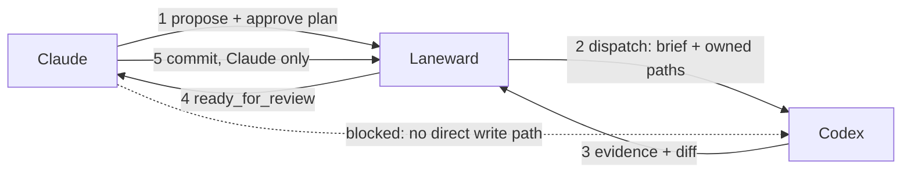

# Target Architecture

## Responsibility boundaries

### Claude Code: cognitive orchestrator

Claude is responsible for:

- understanding the user's real objective;
- researching the repository and external facts;
- asking clarifying questions;
- producing and revising the plan;
- selecting lane boundaries and dependencies;
- selecting project-appropriate concurrency;
- reviewing agent output;
- running or supervising validation;
- creating commits after gates pass;
- integrating verified commits;
- presenting approvals in plain language.

Claude must not bypass Laneward for write execution.

### The write boundary

Claude proposes and approves plans and reviews and commits the result. The agent writes, but only inside a worktree that Laneward created and scoped. There is no direct path from Claude to the agent: every write is routed through Laneward, which enforces owned paths, dependencies, and evidence before a lane can be reviewed or committed.



Step 5 closes the loop back into Laneward rather than Git directly: Laneward records the commit against the lane before it moves to integration. The dashed edge is not a rule Claude follows, it is a connection that is never wired up; the agent has no path to receive work except through a lane Laneward dispatched.

### Laneward: deterministic control plane

Laneward is responsible for:

- storing plans and revisions;
- recording exactly what the user approved;
- creating and owning write worktrees;
- registering lanes;
- enforcing dependencies and owned paths;
- dispatching agent workers;
- storing logs and evidence;
- tracking approvals and failures;
- exposing dashboard state;
- emitting attention events;
- recovering safely after interruption.

Laneward records decisions but does not invent them.

Worktree ownership is a target, not a current fact. As of 2026-08-15 `scripts/new-lane.ts` creates the worktree and Laneward registers the path it is given. The transfer is deferred by decision; see `09-implementation-roadmap.md`.

### The agent: write worker

The agent receives a bounded brief, owned paths, constraints, and validation expectations. Which agent is a named preset (`src/agent.ts`); there is no default.

The agent may:

- read the assigned repository;
- edit only approved paths;
- run approved local commands and tests;
- report ambiguity, approval needs, and host-verification needs;
- leave the worktree ready for review.

The agent may not mutate Git state or expand scope.

### Claude subagents: read-only helpers

Native Claude subagents may perform:

- repository mapping;
- targeted research;
- alternative analysis;
- code review;
- failure diagnosis;
- risk assessment.

They do not perform write work outside Laneward.

## Sources of truth

| Concern | Source of truth |
|---|---|
| Approved intent | Laneward plan revision and approval record |
| Live operational state | Laneward |
| Source code and durable history | Git |
| Durable decisions and reasons | Project-local documentation |
| Volatile execution logs | Laneward runtime state |
| Runtime correctness | Target-environment verification evidence |

No volatile lane status should be manually duplicated into decision documents.

## Claude ↔ Laneward bridge

The bridge should expose structured operations rather than rely on free-form shell conventions.

Initial operations:

- create or revise a plan;
- submit a plan for user approval;
- create lanes from an approved plan;
- inspect lane and approval state;
- resume an approved lane;
- record review results;
- mark a lane ready for commit;
- record the Claude-created commit;
- begin integration validation;
- request runtime approval;
- record runtime evidence;
- close the plan as done.

The bridge may begin as a project CLI or MCP server. The interface must be stable enough for hooks and skills to call without scraping terminal text.

## Hook responsibilities

Claude instructions describe policy. Hooks enforce non-negotiable controls.

Every hook below was verified against the Claude Code hook reference on
2026-08-08, against Claude Code 2.1.226. All of them exist, including
`TaskCreated`, `TaskCompleted` and `SubagentStart`, which this document
previously flagged as doubtful.

Only the non-blocking ones are wired. A hook that can block or replace a Claude Code operation puts this project's availability in front of the operator's own checkout, and its failure mode takes away the tools needed to recover; the blocking events below are recorded as evaluated and rejected, not as pending work. Enforcement belongs on the hub, where a failure denies a dispatch rather than a developer.

Hooks considered:

- `SessionStart`: load project identity, active plan, pending approvals, and ready-for-review lanes. Cannot block, but returns `hookSpecificOutput.additionalContext` to inject that state, and `watchPaths` to arm `FileChanged` for the rest of the session;
- `TaskCreated`: validate required task metadata when Claude creates internal tasks. Blocks with exit 2 or `{"decision": "block"}`;
- `TaskCompleted`: block false completion when required checks or Laneward evidence are missing. Same blocking contract;
- `SubagentStart` and `SubagentStop`: mirror read-only helper lifecycle. `SubagentStart` cannot block, `SubagentStop` can;
- `PreToolUse`: **evaluated and not wired.** It is the only event whose contract `bridge gate` fits, and narrowing it with a `matcher` to the mutating tools does work, but a fail-closed HTTP call in front of `Edit`, `Write` and `Bash` means a hub outage locks the main checkout, including the tools needed to unwire the hook. `checkGate` on the hub stays the enforcement point;
- `WorktreeCreate`: not usable as a gate. The event replaces default worktree creation instead of vetting it: the hook must create the worktree itself and print its absolute path on stdout, and a run that prints nothing aborts creation. Its `cwd` is the main checkout, not the lane worktree, so it cannot even identify the lane. Worktree creation stays with `scripts/new-lane.ts`;
- `SessionEnd`: write a project-local handoff and detach cleanly from active work. Cannot block, and carries a `reason` field distinguishing `clear`, `resume`, `logout` and `prompt_input_exit`.

A Laneward outage must not silently convert a denied operation into an allowed one. Critical enforcement should use a local command path with explicit failure behavior.

## Project-local structure

Recommended target:

```text
project/
├── .laneward/
│   ├── project.json
│   ├── plans/
│   └── runtime/          # gitignored
├── .claude/
│   ├── skills/
│   └── hooks/
├── docs/
│   └── decisions/
├── reports/
│   └── acos/
└── source files
```

`project.json` defines project-specific checks and runtime behavior. Claude must not guess these repeatedly.
