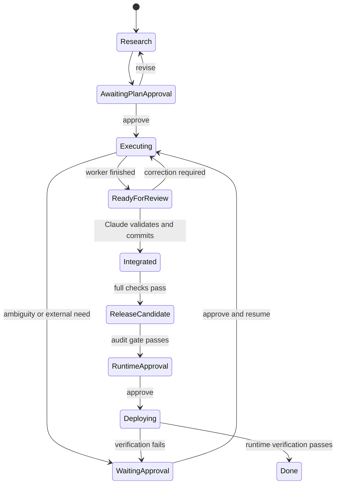

# Workflow lifecycle

## State overview



## 1. Intake and research

Every task begins in Claude Code.

Claude:

1. identifies the target repository and environment;
2. reads project instructions and `.laneward/project.json`;
3. reads current Laneward state;
4. performs read-only repository exploration;
5. uses read-only subagents when beneficial;
6. asks the user questions needed to eliminate material ambiguity.

No write lane is created during this stage.

## 2. Plan construction

The plan shown to the user contains at minimum:

- objective and expected user-visible outcome;
- assumptions and exclusions;
- lane list and dependency graph;
- owned paths for every write lane;
- expected tests for every lane;
- integration checks;
- network needs;
- external or destructive effects;
- real-environment verification;
- proposed concurrency;
- risks and rollback approach.

Claude explains the plan in plain language before requesting approval.

## 3. Approval and revision

Approval applies to a specific immutable plan revision.

If Claude changes material scope, it creates a new revision and asks again.

The approval record includes:

- plan ID;
- revision;
- timestamp;
- approved scope;
- risk summary;
- approved network and runtime effects;
- user decision.

## 4. Lane creation

Only after approval may Claude ask Laneward to:

1. create the integration branch;
2. create lane branches and worktrees;
3. register briefs, dependencies, and owned paths;
4. calculate dispatchability;
5. start eligible workers.

Laneward owns all write worktrees.

## 5. Worker execution

Each agent worker receives:

- one bounded goal;
- explicit owned paths;
- relevant context;
- prohibited actions;
- lane-level checks;
- escalation protocol.

A worker that needs new scope, unapproved network access, credentials, destructive effects, or host-level verification moves the lane to `waiting_approval`.

## 6. Review and commit

A successful agent exit is not proof of correctness.

When the worker exits, the conductor runs the project's lane checks and stores their results as lane evidence. Only then does Laneward mark the lane `ready_for_review`.

Claude then:

1. inspects the diff;
2. confirms only owned paths changed;
3. reads the recorded check results;
4. compares the result against the approved brief;
5. either requests correction or creates a focused commit.

Claude does not run the deterministic checks itself. Verification therefore keeps progressing while Claude Code is closed.

Only Claude creates the commit.

## 7. Integration

The lane commits of the plan's newest revision are merged onto:

```text
integration/<plan-id>-r<revision>
```

Not by Claude: D-032 builds the candidate with `bun run build-candidate <plan_id>`, and per issue #5 the conductor takes that over, so a candidate exists whether or not a session is open. The original wording here said Claude transfers the commits and named the branch `integration/<plan-id>-<short-name>`; a plan carries no short name, and the revision is what the candidate and its verification record are scoped to.

The full integration gate defined by the project then runs against the built tree.

A failed integration gate creates a new bounded correction lane or returns the relevant lane to work. It does not trigger an unapproved rewrite.

## 8. Release candidate

Until the verification layer is built, this stage consists of deterministic tests and Claude review.

The verification layer runs here, before merge, push, and installation: the independent clean run first, then the advisory reader, per D-028. ACOS is not part of it.

Findings are recorded and summarized non-technically. Findings never create correction lanes without user approval. The reader's findings advise and never block, per D-027, and an empty reader report is `no_findings` rather than a pass.

## 9. Merge, push, and runtime approval

Claude presents:

- the completed outcome;
- test evidence;
- remaining risks;
- verification-layer result when available;
- proposed merge and push;
- installation or runtime effects;
- rollback procedure.

The user explicitly approves merge, push, and real-environment effects.

## 10. Deployment and completion

The result is installed and verified against the project-specific runtime contract.

The plan becomes `done` only when:

- required code is integrated;
- approved merge and push are complete;
- installation succeeds;
- target behavior is observed;
- evidence is recorded;
- no unresolved blocking approval remains.

Lane worktrees and branches are then removed. The evidence, logs, and commits stay.
