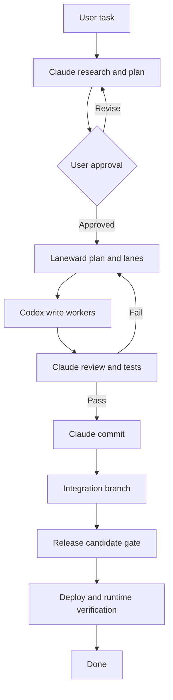

# Claude Code + Laneward Workflow v1

Status: approved architecture baseline  
Decision date: 2026-08-03  
Revised: 2026-08-05 (roadmap order, check ownership, cleanup, documented-versus-enforced boundaries)  
Revised: 2026-08-07 (platform support, Git-boundary enforcement moved off the sandbox, Phase 2 probe measured)  
Implementation status (2026-08-15): largely implemented. The plan, lane, gate,
verification and dashboard surfaces described here exist and are covered by the
suite. What remains unbuilt is recorded per decision as a `Current state` line
and in the README's `Limitations`.

A `Current state` line in this document set states the date it was measured. A
line without a date is a memory, not a measurement.

This document set supersedes an earlier gaps-and-recommendations note, which was retired once it had been fully absorbed here.

## Purpose

This document set defines how Claude Code, Laneward, Codex workers, project-local records, validation gates, Linux services, and the independent verification layer work together.

The system is intended primarily for:

- developing new applications;
- adding features and fixing defects in existing projects;
- building and maintaining Linux services;
- creating and operating automations.

A task is not complete merely because code was written or tests passed. It is complete only after the result is installed in its target environment and its real behavior is verified.

## Core distinction

Claude Code is the cognitive orchestrator. It interprets the user's goal, performs research, asks questions, produces a plan, makes judgment calls, and integrates results.

Laneward is the deterministic control plane. It records approved plans, creates and schedules lanes, enforces dependencies and ownership, tracks execution, stores evidence, manages approvals, and exposes operational state.

Laneward must not become a second reasoning brain. Claude decides; Laneward records and enforces the approved decision.

## Document map

1. [Decisions](01-decisions.md)
2. [Target architecture](02-target-architecture.md)
3. [Workflow lifecycle](03-workflow-lifecycle.md)
4. [Plan and lane model](04-plan-and-lane-model.md)
5. [Safety and Git policy](05-safety-and-git-policy.md)
6. [Operations and notifications](06-operations-and-notifications.md)
7. [Skill changes](07-skill-changes.md)
8. [Future ACOS integration](08-acos-integration.md)
9. [Implementation roadmap](09-implementation-roadmap.md)
10. [Platform support](10-platform-support.md)

## Active, deferred, and excluded systems

| System | v1 status | Role |
|---|---|---|
| Claude Code | Active | Single user entry point and cognitive orchestrator |
| Laneward | Active | Central operational control plane |
| Codex | Active | Write worker; no Git authority |
| Claude subagents | Active | Read-only research and review helpers |
| Dashboard | Active target | Operational inspection |
| Linux notifications | Active target | Attention and approval alerts |
| Windows | Active target | First-class platform alongside Linux (D-022) |
| macOS | Excluded | No path designed, documented, or verified |
| Verification layer | Decided, unbuilt | Independent clean run, then an advisory reader (D-028) |
| ACOS | Deferred | Not the audit layer; refactoring ACOS itself is a separate pilot (D-021) |
| GPT Pro handoff | Disabled | No active GPT Pro subscription |
| OMP | Excluded | Removed until separately measured and reconsidered |

## Non-goals

- Laneward does not replace Claude's reasoning.
- Codex does not create commits, branches, merges, or pushes.
- Obsidian is not part of project state management.
- OMP is not part of this architecture.
- GPT Pro is not a dependency.
- ACOS does not block the initial implementation.
