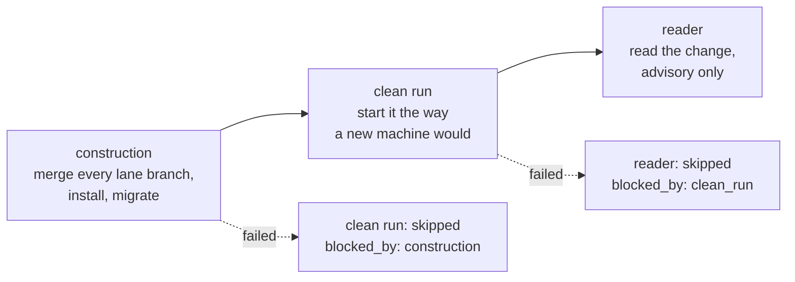

# Plans, revisions and authority

Everything so far works with loose lanes. A plan adds the thing loose lanes
cannot have: a way to withdraw permission from work already in flight, and a
point at which several finished lanes are put together and checked as one.

Skip this page if you are driving single lanes by hand. It is what the rest of
the machinery is for.

## The shape

A **plan** is one approved piece of work, big enough to split into several
lanes. A **plan revision** is a numbered version of that plan's content. A lane
may be bound to a revision, and then:

- it may start only while that revision is **approved**, and
- it may start only while that revision is **the newest one**.

That second rule is the whole design. A material change of scope becomes a new
revision, and creating it silently withdraws the execution authority of every
lane still bound to the old one. Nobody has to go and stop them.

```bash
# create the plan; this is revision 1
curl -s -X POST http://127.0.0.1:8787/plans \
  -H 'content-type: application/json' \
  -d '{"plan_id":"login-hardening","title":"Login hardening","content":{"lanes":["fix-login","rate-limit"]}}'

# approve it
curl -s -X POST http://127.0.0.1:8787/plans/login-hardening/revisions/1/approve \
  -H 'content-type: application/json' -d '{"approved_by":"human"}'
```

The response to either call carries the `revision_id`. Bind a lane to it at
registration:

```bash
LANE_REPO=/home/you/your-repo \
LANE_PLAN_REVISION_ID=<revision_id> \
  bun scripts/new-lane.ts fix-login brief.md 'src/auth/*'
```

Changing the plan is a new revision, not an edit:

```bash
curl -s -X POST http://127.0.0.1:8787/plans/login-hardening/revisions \
  -H 'content-type: application/json' -d '{"content":{"lanes":["fix-login"]}}'
```

From that moment, a lane bound to revision 1 stays `pending` and says why:
`lane's plan revision 1 is superseded by revision 2`. Rebind it by registering
it against the new revision, or approve the new revision and register fresh
lanes.

## The integration candidate

When every lane on the newest revision is `completed`, that revision is due for
integration. The conductor builds it at the end of a drain pass, once no lane is
running; you can also do it by hand:

```bash
bun run build-candidate login-hardening
bun run build-candidate login-hardening --rebuild   # after a failed attempt
```

It creates a worktree on branch `integration/login-hardening-r2` at the
repository's current `HEAD`, merges each lane branch into it with `--no-ff` in
lane-id order, copies `.env`, provisions a candidate database whose name ends in
`_test`, runs `bun install`, and runs `db:migrate` if the repository declares
it.

It refuses, and changes nothing, when the plan has no lanes, when a lane on the
newest revision is not `completed`, when a candidate already exists and you did
not ask for a rebuild, when the previous attempt did not fail, or when a plan
revision approval is still unresolved. Each refusal names which one it is.

A failure part-way through leaves the debris in place and says so, opens an
approval against the plan revision, and records the step that broke: merge of a
particular lane branch, `bun install`, `db:migrate`, and so on. That approval is
what puts the revision into `GET /pending`.

## The three verification layers

They run in order, and each one records its own result against the revision:



**Construction** is the merge above. **Clean run** installs and starts the
candidate and scores its output against the expectations the driven repository
declares; see [Preparing the driven repository](driven-repo.md#clean-run).
**Reader** reads the diff rather than running it.

A layer whose predecessor did not succeed is recorded as `skipped` with the
layer that blocked it, not silently omitted.

## The reader {#the-reader}

The reader is an advisory read-only review of the candidate. It gets two diffs:
the test paths the manifest declares, as its subject, and everything else as
context it may read but is not reviewing. The question it answers is whether the
change weakened what the tests prove. It advises and never blocks.

It runs under the read-only command your agent preset provides. If you declared
a raw `LANEWARD_AGENT_WRITE` without a `LANEWARD_AGENT_READ`, the layer is
skipped rather than run unconfined over the candidate it is reviewing.

Each finding carries the text, whether it is `test_diff` or `source_context`,
whether it falls outside the change, and the file locations it points at. Every
finding starts `open` and waits for you:

```bash
curl -s -X POST http://127.0.0.1:8787/verification-findings/<id>/adjudication \
  -H 'content-type: application/json' \
  -d '{"state":"rejected","note":"The assertion it flagged is covered by the integration test."}'
```

| State | Meaning |
|---|---|
| `accepted` | A real finding. Act on it. |
| `rejected` | A false alarm. It is fed back into the next reader run so it does not come back forever. |
| `deferred` | Real, not now. |

Rejected findings are handed to the next reader run with the instruction not to
raise them again, but not as a mechanical filter: it is told they were
adjudicated false, not that the ground is off limits.

!!! note "A reader run that found nothing is not a pass"

    Its status is `no_findings`, deliberately distinct from `succeeded`. The
    reader samples, so an empty run is a sampling that happened to be empty and
    never a check that passed. Recorded as `succeeded` it would read like one,
    and the database refuses that value from any other layer.
