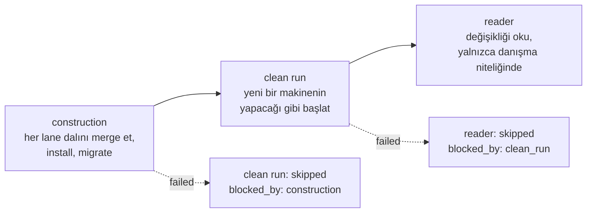

# Planlar, revizyonlar ve yetki

Şimdiye kadarki her şey serbest lane'lerle çalışır. Bir plan, serbest lane'lerin
sahip olamadığı şeyi ekler: halihazırda devam eden işten izni geri çekmenin bir
yolu ve birkaç tamamlanmış lane'in bir araya getirilip tek parça halinde kontrol
edildiği bir nokta.

Tek tek lane'leri elle çalıştırıyorsan bu sayfayı atla. Bu sayfa,
mekanizmanın geri kalanının ne işe yaradığını anlatır.

## Yapı

Bir **plan**, birkaç lane'e bölünebilecek kadar büyük, onaylanmış tek bir iş
parçasıdır. Bir **plan revision**, o planın içeriğinin numaralandırılmış bir
versiyonudur. Bir lane bir revision'a bağlanabilir ve bu durumda:

- yalnızca o revision **approved** iken başlayabilir, ve
- yalnızca o revision **en yenisi** iken başlayabilir.

İkinci kural tasarımın tamamıdır. Kapsamdaki maddi bir değişiklik yeni bir
revision haline gelir ve bunu oluşturmak, eski revision'a hâlâ bağlı olan her
lane'in çalıştırma yetkisini sessizce geri çeker. Kimsenin gidip onları
durdurması gerekmez.

```bash
# create the plan; this is revision 1
curl -s -X POST http://127.0.0.1:8787/plans \
  -H 'content-type: application/json' \
  -d '{"plan_id":"login-hardening","title":"Login hardening","content":{"lanes":["fix-login","rate-limit"]}}'

# approve it
curl -s -X POST http://127.0.0.1:8787/plans/login-hardening/revisions/1/approve \
  -H 'content-type: application/json' -d '{"approved_by":"human"}'
```

Her iki çağrının yanıtı da `revision_id` taşır. Kayıt sırasında bir lane'i buna
bağla:

```bash
LANE_REPO=/home/you/your-repo \
LANE_PLAN_REVISION_ID=<revision_id> \
  bun scripts/new-lane.ts fix-login brief.md 'src/auth/*'
```

Planı değiştirmek bir düzenleme değil, yeni bir revision'dır:

```bash
curl -s -X POST http://127.0.0.1:8787/plans/login-hardening/revisions \
  -H 'content-type: application/json' -d '{"content":{"lanes":["fix-login"]}}'
```

O andan itibaren, revision 1'e bağlı bir lane `pending` kalır ve nedenini
söyler: `lane's plan revision 1 is superseded by revision 2`. Onu, yeni
revision'a karşı yeniden kaydederek bağla, ya da yeni revision'ı onaylayıp
taze lane'ler kaydet.

## Entegrasyon candidate'ı

En yeni revision'daki her lane `completed` olduğunda, o revision entegrasyona
hazır demektir. Conductor bunu, hiçbir lane çalışmıyorkenki bir boşaltma
turunun sonunda inşa eder; bunu elle de yapabilirsin:

```bash
bun run build-candidate login-hardening
bun run build-candidate login-hardening --rebuild   # after a failed attempt
```

Deponun şu anki `HEAD`'inde `integration/login-hardening-r2` dalında bir
worktree oluşturur, her lane dalını lane-id sırasına göre `--no-ff` ile buna
merge eder, `.env`'i kopyalar, adı `_test` ile biten bir candidate veritabanı
sağlar, `bun install` çalıştırır ve depo bunu tanımlıyorsa `db:migrate`
çalıştırır.

Planın hiç lane'i yoksa, en yeni revision'daki bir lane `completed` değilse,
bir candidate zaten varsa ve rebuild istemediysen, önceki deneme başarısız
olmadıysa ya da bir plan revision onayı hâlâ çözülmemişse, hiçbir şeyi
değiştirmeden reddeder. Her reddediş hangisi olduğunu belirtir.

Yarı yolda oluşan bir hata, kalıntıları olduğu gibi bırakır ve bunu belirtir,
plan revision'a karşı bir onay açar ve hangi adımın bozulduğunu kaydeder:
belirli bir lane dalının merge'i, `bun install`, `db:migrate` ve benzeri.
Revision'ı `GET /pending`'e sokan şey de bu onaydır.

## Üç doğrulama katmanı

Sırayla çalışırlar ve her biri kendi sonucunu revision'a karşı kaydeder:



**Construction**, yukarıdaki merge işlemidir. **Clean run**, candidate'ı kurar
ve başlatır, çıktısını sürülen deponun belirttiği beklentilere göre
puanlar; bkz. [Sürülen deponun hazırlanması](driven-repo.md#clean-run).
**Reader** ise değişikliği çalıştırmak yerine diff'i okur.

Kendinden önceki katman başarılı olmadıysa, o katman sessizce atlanmaz; onu
bloke eden katmanla birlikte `skipped` olarak kaydedilir.

## Reader {#the-reader}

Reader, candidate'ın danışma niteliğinde, salt okunur bir incelemesidir. İki
diff alır: manifest'in belirttiği test yollarını konu olarak, geri kalan her
şeyi ise okuyabileceği ama incelemediği bağlam olarak. Yanıtladığı soru,
değişikliğin testlerin kanıtladığı şeyi zayıflatıp zayıflatmadığıdır. Yalnızca
öneride bulunur, asla bloke etmez.

Ajan preset'inin sağladığı salt okunur komut altında çalışır. Bir
`LANEWARD_AGENT_READ` olmadan ham bir `LANEWARD_AGENT_WRITE` tanımladıysan,
bu katman incelediği candidate üzerinde sınırsız biçimde çalıştırılmak yerine
skipped olur.

Her bulgu; metni, `test_diff` mi yoksa `source_context` mü olduğunu,
değişikliğin dışında kalıp kalmadığını ve işaret ettiği dosya konumlarını
taşır. Her bulgu `open` olarak başlar ve seni bekler:

```bash
curl -s -X POST http://127.0.0.1:8787/verification-findings/<id>/adjudication \
  -H 'content-type: application/json' \
  -d '{"state":"rejected","note":"The assertion it flagged is covered by the integration test."}'
```

| State | Meaning |
|---|---|
| `accepted` | Gerçek bir bulgu. Buna göre hareket et. |
| `rejected` | Yanlış alarm. Bir daha sonsuza dek karşına çıkmaması için bir sonraki reader çalışmasına geri beslenir. |
| `deferred` | Gerçek, ama şimdi değil. |

Reddedilen bulgular, tekrar gündeme getirilmemeleri talimatıyla bir sonraki
reader çalışmasına verilir, ama mekanik bir filtre olarak değil: reader'a
bunların yanlış olarak karara bağlandığı söylenir, o bölgenin yasak olduğu
değil.

!!! note "Hiçbir şey bulmayan bir reader çalışması geçti sayılmaz"

    Durumu, `succeeded`'dan kasıtlı olarak farklı olan `no_findings`'dir.
    Reader örnekleme yapar, bu yüzden boş bir çalışma, boşa çıkmış bir
    örneklemedir ve asla geçmiş bir kontrol değildir. `succeeded` olarak
    kaydedilseydi geçmiş gibi okunurdu ve veritabanı bu değeri başka herhangi
    bir katman için de reddeder.
