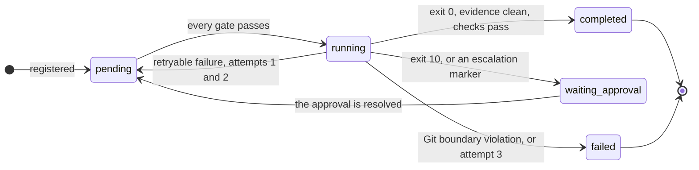

---
hide:
  - navigation
---

# Laneward

Runs several coding agents on one repository at the same time, each in its own
git worktree, and keeps them from colliding. Approved work continues after you
close your editor.

[Install it](guide/install.md){ .md-button .md-button--primary }
[Read what it does not protect you from](guide/safety-and-limits.md){ .md-button }

It does not plan work and it does not write code. You decide what needs doing;
Laneward records each task, decides when it is safe to start, spawns the agent,
checks what it touched, and shows the result on one screen.

!!! important "Read this before you install, not after"

    Laneward listens on `127.0.0.1` with **no authentication**. It is built for
    one trusted single-user machine. Do not expose it.

    Each lane's worktree receives a **copy of the driven repository's `.env`**,
    so an agent can read your real secret values. Only `DATABASE_URL` is
    rewritten, to a database created for that lane. Redaction is not
    implemented. See [Safety and limits](guide/safety-and-limits.md).

## The three moving parts

**The hub** is a long-running web service. It owns every record (plans, lanes,
messages, approvals, notifications), answers HTTP on `127.0.0.1:8787`, and
serves the dashboard. It decides nothing on its own: it answers questions and
stores answers.

**The conductor** is a loop that does the work the hub only records. Every five
seconds it asks the hub what it may start, spawns an agent for each lane it is
allowed to run, scores what the agent touched, and reports back. It exists so
work continues while no editor session is open.

**The agent** is whatever coding agent you declared: Codex, Claude Code, or a
raw command of your own. It reads a brief on stdin, works inside the worktree it
is given, and signals with its exit code. Laneward ships no default agent, and
refuses the first lane until you declare one.

## A lane

A lane is one bounded task given to one agent. It owns:

- a set of **file paths** nobody else may touch while it is unfinished,
- a **worktree**, at `<repo>-worktrees/<lane_id>`,
- a **branch**, `lane/<lane_id>`,
- usually a **database of its own**, created by copying the driven repository's
  connection and renaming the database.

Two lanes whose paths overlap cannot run at the same time, and the hub refuses
to register the second one at all while the first is unfinished. That refusal is
the whole point of the system.

## How a lane ends

`completed` means the agent exited 0, touched only what it owned, and the checks
the driven repository declares passed. It does **not** mean the work is correct,
reviewed, committed, or merged. Commit and merge stay manual by design.

## What it will not do for you

- Plan work, split it into lanes, or write briefs.
- Commit, merge, push, or open pull requests. All four are deliberately manual.
- Redact secrets from the `.env` it copies into a lane worktree.
- Prevent a second conductor from running against the same database.
- Authenticate anything, or serve anywhere but `127.0.0.1`.

## Project status

Development has stopped, and the reason is money rather than interest. What
works was measured rather than assumed, and the runs are written up in the
[evidence notes](notes/2026-08-19-what-is-left.md), including what each one
failed to establish. Issues and pull requests may go unanswered. The licence is
MIT: fork it, take it somewhere, no permission needed.

If you are looking for something to run in production, this is not it. If you
are looking for a working design to read, take apart, or continue, that is
exactly what is here, and this guide is how you get it running.

## Where to go next

-   :material-download: __Install and first run__

    ---

    A hub, a conductor and a database, from a clone, on this machine.

    [:octicons-arrow-right-24: Install](guide/install.md)

-   :material-tune: __Configuration__

    ---

    Declare an agent, fill the model tiers, and read every variable there is.

    [:octicons-arrow-right-24: Configure](guide/configure.md)

-   :material-road-variant: __Your first lane__

    ---

    One real task end to end: brief, lane, agent, verdict, work in your hands.

    [:octicons-arrow-right-24: Drive a lane](guide/first-lane.md)

-   :material-file-document-edit: __Writing briefs__

    ---

    The contract the agent actually reads, and how to make it score correctly.

    [:octicons-arrow-right-24: Write a brief](guide/writing-briefs.md)

-   :material-lifebuoy: __Troubleshooting__

    ---

    Why a lane will not start, and what every refusal in the system means.

    [:octicons-arrow-right-24: Diagnose it](guide/troubleshooting.md)

-   :material-shield-alert: __Safety and limits__

    ---

    No authentication, a copied `.env`, and what has actually been verified.

    [:octicons-arrow-right-24: Read the limits](guide/safety-and-limits.md)

The [glossary](GLOSSARY.md) is the vocabulary this project uses in a specific
sense, and [the architecture series](architecture/workflow-v1/README.md) is the
design underneath, including the decision log every `D-0NN` reference points at.
