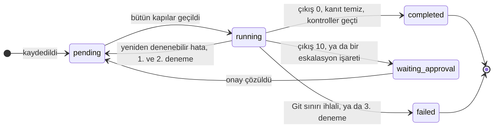

# Laneward nedir

Laneward, tek bir depo üzerinde aynı anda birden çok kodlama ajanı çalıştırır,
her birini kendi git worktree'sine koyar ve birbirlerine çarpmalarını engeller.
Onaylanmış iş, editörünü kapattıktan sonra da sürer.

İş planlamaz, kod yazmaz. Neyin yapılacağına sen karar verirsin; Laneward her
görevi kaydeder, ne zaman başlamanın güvenli olduğuna karar verir, ajanı
başlatır, neye dokunduğunu denetler ve sonucu tek ekranda gösterir.

!!! important "Bunu kurulumdan sonra değil, önce oku"

    Laneward `127.0.0.1` üzerinde, **kimlik doğrulaması olmadan** dinler. Tek
    kullanıcılı, güvenilen bir makine için tasarlandı. Dışarı açma.

    Her lane'in worktree'si, sürülen deponun **`.env` dosyasının bir kopyasını**
    alır; yani ajan senin gerçek gizli değerlerini okuyabilir. Yalnızca
    `DATABASE_URL` yeniden yazılır, o lane için açılan veritabanına. Maskeleme
    yok. Bkz. [Güvenlik ve sınırlar](guide/safety-and-limits.md).

## Üç hareketli parça

**Hub**, sürekli çalışan bir web servisidir. Bütün kayıtlar onundur (planlar,
lane'ler, mesajlar, onaylar, bildirimler), `127.0.0.1:8787` üzerinden HTTP
yanıtlar ve panoyu sunar. Kendi başına hiçbir şeye karar vermez: soru yanıtlar ve
yanıtları saklar.

**Conductor**, hub'ın yalnızca kaydettiği işi yapan döngüdür. Her beş saniyede
bir hub'a neyi başlatabileceğini sorar, izin verilen her lane için bir ajan
başlatır, ajanın neye dokunduğunu puanlar ve sonucu geri bildirir. Açık bir
editör oturumu yokken de işin sürmesi için vardır.

**Ajan**, tanımladığın kodlama ajanıdır: Codex, Claude Code veya kendi ham
komutun. Brief'i stdin'den okur, kendisine verilen worktree içinde çalışır ve
çıkış koduyla sinyal verir. Laneward varsayılan bir ajanla gelmez ve sen birini
tanımlayana kadar ilk lane'i reddeder.

## Lane

Lane, tek bir ajana verilen, sınırları belli tek bir iştir. Şunlara sahiptir:

- bitmediği sürece başkasının dokunamayacağı bir **dosya yolu kümesi**,
- `<repo>-worktrees/<lane_id>` altında bir **worktree**,
- `lane/<lane_id>` adında bir **dal**,
- ve genellikle **kendi veritabanı**: sürülen deponun bağlantısı kopyalanıp
  veritabanı adı değiştirilerek oluşturulur.

Yolları kesişen iki lane aynı anda çalışamaz; dahası hub, ilki bitmemişken
ikincisini kaydetmeyi baştan reddeder. Sistemin bütün mesele ettiği şey bu
reddir.

## Bir lane nasıl biter

`completed`, ajanın 0 ile çıktığı, yalnızca sahip olduğu yollara dokunduğu ve
sürülen deponun tanımladığı kontrollerin geçtiği anlamına gelir. İşin **doğru,
gözden geçirilmiş, commit edilmiş veya merge edilmiş** olduğu anlamına gelmez.
Commit ve merge, tasarım gereği elle yapılır.

## Senin yerine yapmayacakları

- İş planlamak, lane'lere bölmek, brief yazmak.
- Commit, merge, push, pull request açmak. Dördü de bilerek elle bırakıldı.
- Lane worktree'sine kopyaladığı `.env` içindeki sırları maskelemek.
- Aynı veritabanına karşı ikinci bir conductor çalışmasını engellemek.
- Herhangi bir kimlik doğrulaması yapmak veya `127.0.0.1` dışında sunmak.

## Projenin durumu

Geliştirme durdu; sebep ilgi değil, para. Çalışan şeyler varsayılmadı, ölçüldü;
koşular [kanıt notlarında](notes/2026-08-19-what-is-left.md) yazılı ve her biri
neyi **kanıtlayamadığını** da söylüyor. Issue ve pull request'ler yanıtsız
kalabilir. Lisans MIT: fork et, başka bir yere taşı, izin gerekmiyor.

Üretimde çalıştıracak bir şey arıyorsan bu o değil. Okunacak, sökülecek veya
devam ettirilecek çalışan bir tasarım arıyorsan, burada olan tam olarak bu; bu
kılavuz da onu çalıştırmanın yolu.

## Nereye gitmeli

| İstediğin | Oku |
|---|---|
| Bu makinede çalıştırmak | [Kurulum ve ilk çalıştırma](guide/install.md) |
| Ajan seçip bağlamak | [Yapılandırma](guide/configure.md) |
| Gerçek bir işi baştan sona sürmek | [İlk lane](guide/first-lane.md) |
| Doğru puanlanan bir brief yazmak | [Brief yazmak](guide/writing-briefs.md) |
| Lane'in neden başlamadığını anlamak | [Sorun giderme](guide/troubleshooting.md) |
| Neye karşı korunmadığını bilmek | [Güvenlik ve sınırlar](guide/safety-and-limits.md) |
| Sözlüğü öğrenmek | [Glossary](GLOSSARY.md) |
